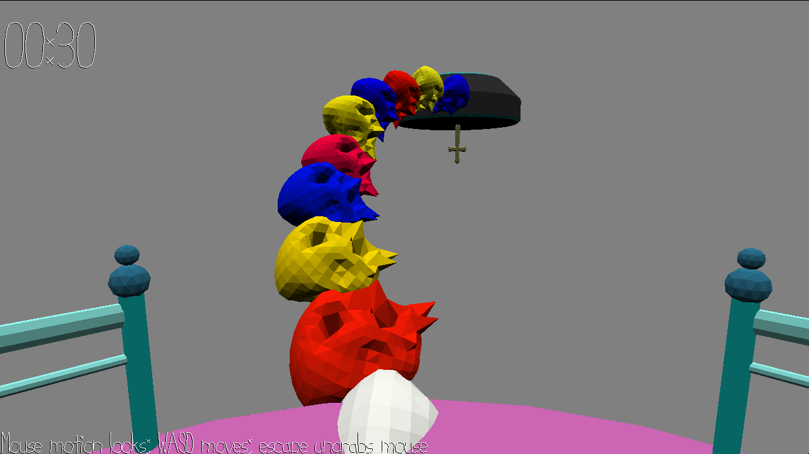

# Creepy Beat

Author: Wei-Che(Wizard) Hsu

Design: Keep walking but look out some ghost platforms would disappear with the beat!

Screen Shot:

How To Play:

Use WASD to walk and use mouse for motion looks. Listen to background beat sound and figure out the pattern of which ghost platform would disappear or show up. If the player steps on the disappeared platform, the player would be sent back to the start platform. When you reaching the platform with the cross, make sure to get it and then return to the start point (during the process, if you step on the disappeared platform, you would be sent to this platform). Try to walk through the ghost platforms and come back as soon as possible!

Sources: 

WalkMesh code reference: https://github.com/hjamal3/Game5/blob/master/WalkMesh.cpp \
Platform models and WalkMesh: phone-bank.blend in the base code folder \
Background beat sound: https://www.youtube.com/watch?v=8rOrQK1okuk 

This game was built with [NEST](NEST.md).
The model assets were built with blender

